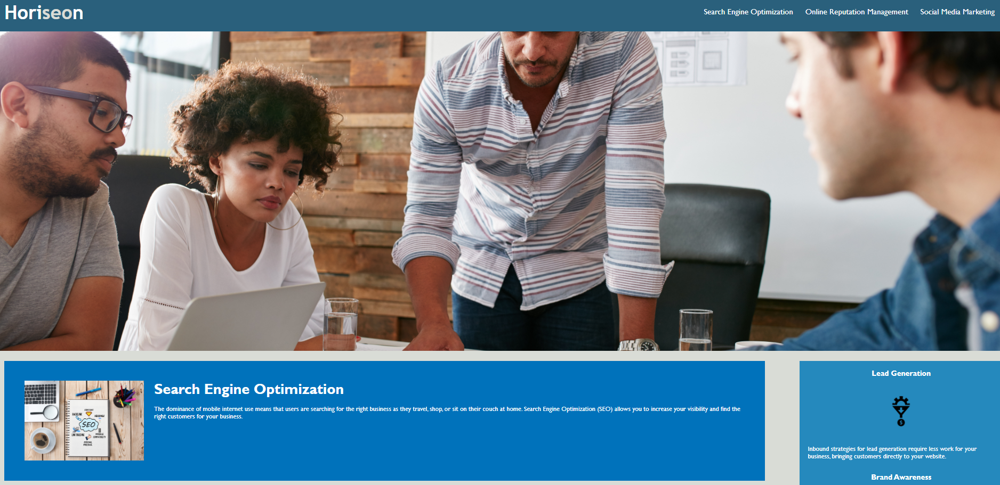

# Responsive-interaction

<!--Added a description of the refactor project.-->

- Description

This is a refactor coding project. The codebase follows accessibility standards
making it optimizable for search engines. The existing code has been restructured to make it more accessible without changing the external behavior. As a result, the code is easier to read while preserving its functionality.

To achive this, semantic elements like Aside,Footer,Header, Main and Nav were used to replace the Div elements.These are more descriptive at representing data. Other resaons for using semanitc elements were;

For the client

1. The use of semantic elements will enable Search engines to consider its contents as important keywords. This will influence the page's search rankings.
2. Contrast has been utilized in the Header using different colors. This is helpful while helping visually impaired users navigate the page.

For a fellow developer

1. The semantic elements suggests to the developer the type of data that will be populated.
2. IUsing semantic is more effecient because developers can find meaningful code in less time than searching though endless divs with .

To make the CSS more efficient, CSS selectors and properties were integrated to follow the semantic structure of the html elements. Comments have been included before each element or section of the page explaining the changes.

For the images, an alt attribute was added with an accessible name.

The title describes a website that provides an improved,responsive user friendly search.

- Screenshot

- Link to deployed app
  To access the project, please use the links below.

Deployed site : https://valkimani.github.io/Responsive-interaction/
Github: https://github.com/Valkimani/Responsive-interaction

- Credits:
  https://developer.mozilla.org/en-US/docs/Glossary/Semantics

- Lincense

MIT License

Copyright (c) [2020] [Valentine Kimani]

Permission is hereby granted, free of charge, to any person obtaining a copy
of this software and associated documentation files (the "Software"), to deal
in the Software without restriction, including without limitation the rights
to use, copy, modify, merge, publish, distribute, sublicense, and/or sell
copies of the Software, and to permit persons to whom the Software is
furnished to do so, subject to the following conditions:

The above copyright notice and this permission notice shall be included in all
copies or substantial portions of the Software.

THE SOFTWARE IS PROVIDED "AS IS", WITHOUT WARRANTY OF ANY KIND, EXPRESS OR
IMPLIED, INCLUDING BUT NOT LIMITED TO THE WARRANTIES OF MERCHANTABILITY,
FITNESS FOR A PARTICULAR PURPOSE AND NONINFRINGEMENT. IN NO EVENT SHALL THE
AUTHORS OR COPYRIGHT HOLDERS BE LIABLE FOR ANY CLAIM, DAMAGES OR OTHER
LIABILITY, WHETHER IN AN ACTION OF CONTRACT, TORT OR OTHERWISE, ARISING FROM,
OUT OF OR IN CONNECTION WITH THE SOFTWARE OR THE USE OR OTHER DEALINGS IN THE
SOFTWARE.
